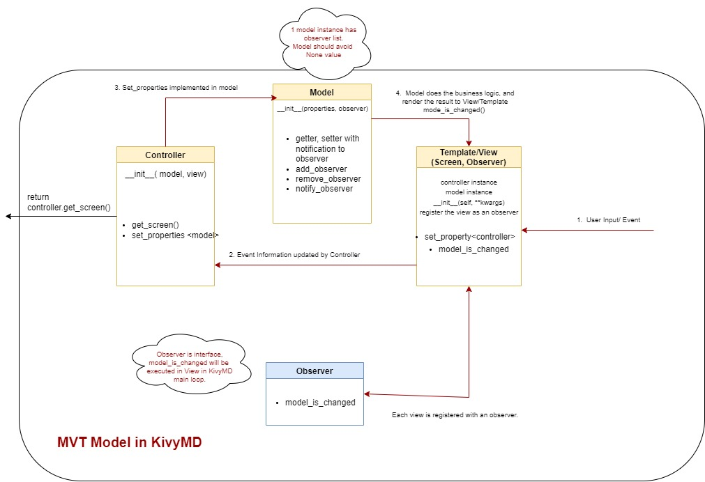
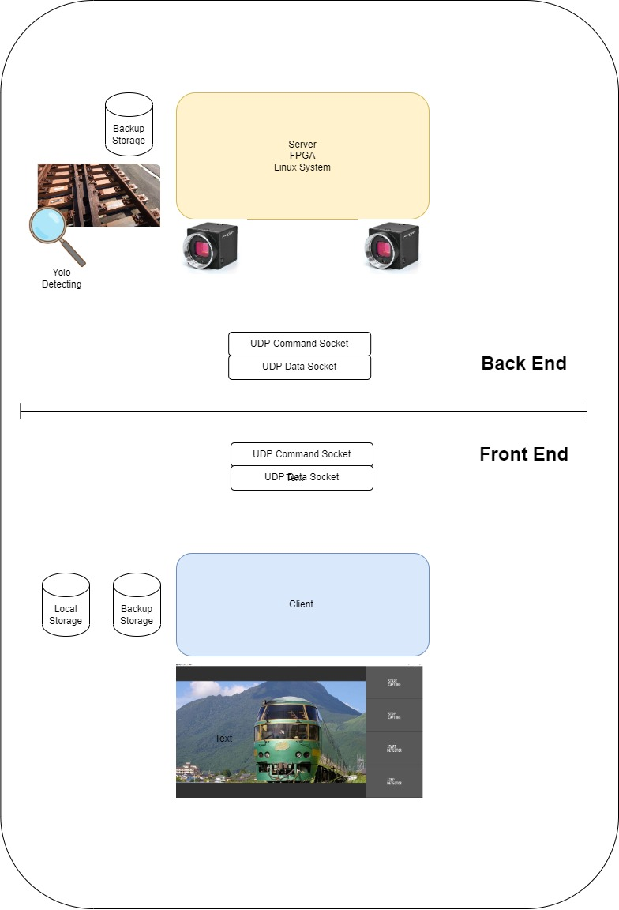

### Minimum Version for JR Kyushu Kivy GUI
- KivyMD project with Model-View/Template-Controller framework 
- Step1: Minimal Framework of MVC in Front End
- 

- Step2: Adding Adapter Interface of UDPSocket to separate the front end and back end
- 